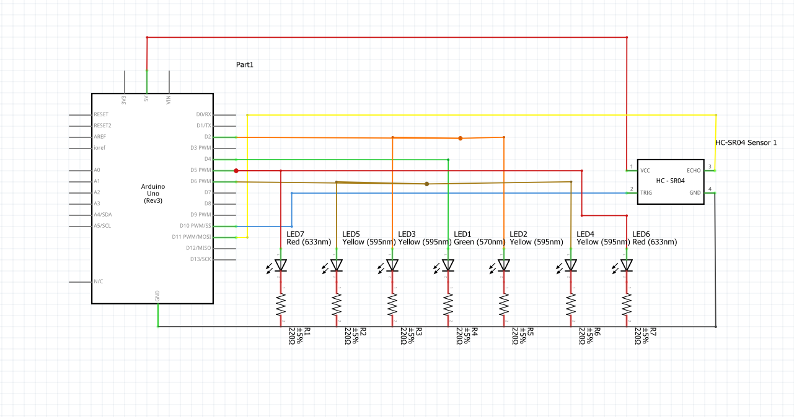

# Proximity sensor with HC-SR04 
This is my second Arduino project, car like parking sensor with leds to indicate the closeness of an object to the sensor;

### How it works?
The HC-SR04 sends an ultrasonic pulse then waits for the response, calculating the distance from itself to the object in front using the formula distance = time × speed of sound ÷ 2.
Based on the distance 7 leds light up progressively to show the proximity to the object in this manner:
| Object proximity | What Happens | How the strip lights up |
|---|---|:---:|
| >15 cm | No LEDs light up | |
| 15–10 cm | Only a green LED lights up, indicating an object is nearby | 🟢 |
| 10–5 cm | The yellow LEDs light up too, indicating the object is getting closer | 🟡🟢🟡 |
| 5–3 cm | The second pair of yellow LEDs lights up, indicating the object is very close | 🟡🟡🟢🟡🟡 |
| ≤3 cm | The red pair lights up, indicating the object is close to making contact | 🔴🟡🟡🟢🟡🟡🔴 |

### Components:
- Arduino Uno
- HC-SR04 ultrasonic sensor
- 7 leds(2 red,4 yellow,1 green)
- 7 220Ω resistor
- 2 breadboards
- Jumper Wires(~15)

### Wiring schematic:

### Video

### See the code [here](code.ino)

